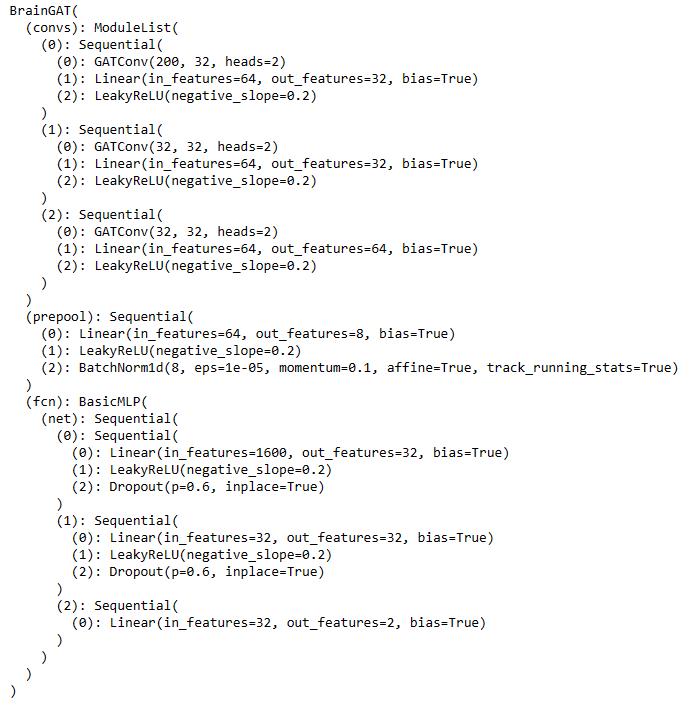
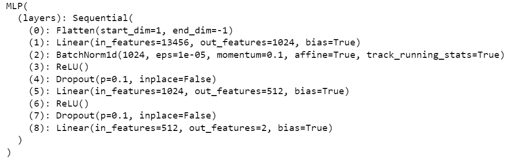
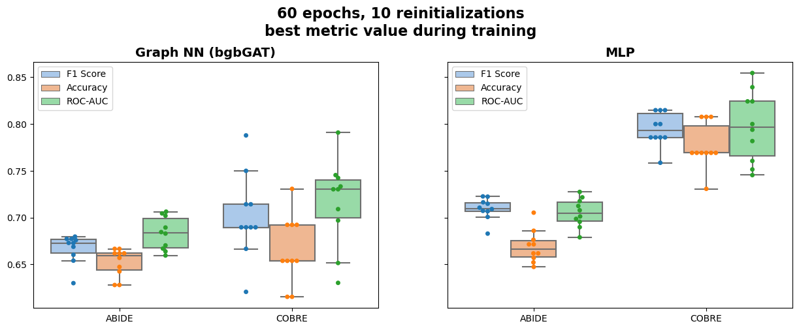

# **CogniNet team Final Project page for Machine Learning**

This repository contains the code and data for the final project course for machine learning, which aims to build benchmarking for classification problems based on fMRI data. The goal of this project is to compare current state-of-the-art methods on unimodal data and determine which approach works best for a given dataset, in order to inform future research in this area.

## **Project presentation and report**

#### [Final project presentation](https://github.com/utoprey/CogniNet/blob/main/CogniNet_FinalProject_Presentation.pdf)
#### [Report](https://github.com/utoprey/CogniNet/blob/main/CogniNet_Final_Project_2023_Machine_Learning.pdf)

# **General Project Goals**
The general project goals are:
* Implement standard machine learning approaches, such as Logistic Regression, SVM, XGBoost, Random Forest and PCA, on unimodal datasets.
* Built a benchmark of ML methods and GAT on unimodal data.

# **Datasets**
For the project have been used two following datasets:
### COBRE
The Collaborative Breaking Down Schizophrenia (COBRE) dataset is a collection of brain imaging data from individuals with schizophrenia and healthy controls. It includes structural and functional MRI data from 152 participants, including 79 patients with schizophrenia and 73 healthy controls. Used labeling in matrices is Automated Anatomical Labeling (AAL).
### ABIDE
The Autism Brain Imaging Data Exchange (ABIDE) is a collection of brain correlation matrixes which were built from brain imaging data from individuals with autism spectrum disorder (ASD) and typically developing individuals. The dataset includes structural and functional MRI data from 1035 participants, including 530 with ASD and 505 healthy controls. Used labeling in matrices is Craddock200.

# **Methods**
1. Code description for ML part

In this notebook we build a gridsearch function (number of folds = 5) which iterates over parametres for different machime learning models' parametres on train and validation splits, then takes the mean f1 score for every fold and defines the best model by this metric. After defining one best model on validation data it's been evaluated on test splits.

#### Figure describing code logic

2. Code description for DL part (Graph Attention Network (GAT) and multilayer perceptron (MPL))

In this notebook Graph NN (bgbGAT) with adjusted hyperparameters is implemented and compared with MLP by F1 Score, Accuracy and ROC-AUC metrics. Part of the notebook is dedicated to preprocessing of the connectivity matrices to convert them into torch geometric data for input in Graph NN. Train-test split of the data is the same as in ML notebook. Don't forget to write `from torch_geometric.nn import Sequential as pygSequential`

#### GAT architecture 

A Graph Attention Network (GAT) is a neural network architecture that operates on graph-structured data, leveraging masked self-attentional layers to address the shortcomings of prior methods based on graph convolutions or their approximations. By stacking layers in which nodes are able to attend over their neighborhoods’ features, a GAT enables (implicitly) specifying different weights to different nodes in a neighborhood, without requiring any kind of costly matrix operation (such as inversion) or depending on knowing the graph structure upfront[^1]

[^1]: Veličković, Petar, et al. "Graph attention networks." arXiv preprint arXiv:1710.10903 (2017).

 
# **Repository Structure**
- **Docs folder**: collection of images and all files used for creating readme.md, presentation and report.
- **ML part folder**: 1) `cobre_2203.ipynb`, 2) `abide_2203.ipynb` and 3) `XGBoost_2203.ipynb` - three notebooks to run classic ML approaches.
- **DL part folder**: `Graph_NN_&_MLP.ipynb` - notebook to run GAT neural network and compare it with MLP
- **abide folder**: 1) `abide_splits.json` - file with id which are split into train-val-test subsrts for 5 folds; 2) `abide_targets.csv` - from here `SUB_ID` or `subject` and `DX_GROUP` can be used as targets.
- **cobre folder**: 1) all folder - collection of data; 2) `cobre_splits_new.json` - splits into train-val-test subsrts for 5 folds; 3) `cobre_targets.tsv` - `Dx` is a target.
- **model_constants.ipynb** - notebook with hyperparameters for ML models.

# **How to Use**
1. Implement classic machine learning (ML) approach
* step 1: Download `data` folder and correct Jupyter notebook considering the dataset you want to analyze
For COBRE go to `utoprey/CogniNet/cobre/aal`, for ABIDE use following link for downloading dataset: [ABIDE dataset](https://drive.google.com/drive/folders/1Xw-x9Zpfe-gEM0OLzDr35dlSzUVp2c2j?usp=sharing).
* step 2: Put your data in one folder. There should lay correct file for splits in `.json` format and appropriate data files `cobre` or `abide` (ex: `C:/Users/ZenBook/Desktop/schizophrenia/cobre/aal`)
* step 3: Run Jupyter notebook

2. Implement graph approach
* step 1: Download `data` folder and correct Jupyter notebook considering the dataset you want to analyze
For COBRE go to `utoprey/CogniNet/cobre/aal`, for ABIDE use following link for downloading dataset: [ABIDE dataset](https://drive.google.com/drive/folders/1Xw-x9Zpfe-gEM0OLzDr35dlSzUVp2c2j?usp=sharing).
* step 2: Put your data in folders `DATA/abide` or `DATA/cobre`, respectively. You may change the pathways to data changing variables `abide_desc_path` (pathway to `Phenotypic_V1_0b_preprocessed1.csv` file), `abide_folders` (pathway to ABIDE participants' folders) and `cobre_csvs_path` (pathway to COBRE participants' folders) in the notebook.
* step 3: Run Jupyter notebook

# **Relevant papers**
Can be found [here](https://arxiv.org/abs/2204.07054) and [here](https://github.com/maryjis/multimodal_DL).

# **Conclusions**
## COBRE results
|      | F1 Score | Accuracy | ROC-AUC |
|------|:--------:|:--------:|:-------:|
| Logistic Regression |  0.73 ± 0.056       |   0.76 ± 0.045       |  0.76 ± 0.049    |
| Random Forest |   0.65 ± 0.073       |   0.69 ± 0.064       |   0.69 ± 0.065      |
| SVM |   **0.76 ± 0.058**      |   0.78 ± 0.039       |   0.79 ± 0.047      |
| SVM + PCA |   0.71 ± 0.099       |   0.76 ± 0.062       |   0.75 ± 0.072      |
| XGBoost |   0.67 ± 0.044       |   0.72 ± 0.029       |   0.71 ± 0.033      |
| bgbGAT |    0.70 ±	0.045   |  0.67 ±	0.036  |   0.72 ±	0.042  |
| MLP   |    **0.79 ± 0.018** 	 |  0.78	± 0.024 | 0.79 ±	0.038  |

## ABIDE results
|      | F1 Score | Accuracy | ROC-AUC |
|------|:--------:|:--------:|:-------:|
| Logistic Regression |  0.66 ± 0.013       |   0.66 ± 0.013       |  0.66 ± 0.013    |
| Random Forest |   0.65 ± 0.037       |   0.67 ± 0.030       |   0.67 ± 0.031      |
| SVM |   0.67 ± 0.012       |   0.67 ± 0.013       |   0.67 ± 0.013      |
| SVM + PCA |   **0.69 ± 0.017**      |   0.68 ± 0.015       |   0.68 ± 0.016     |
| XGBoost |   0.65 ± 0.007       |   0.63 ± 0.010       |   0.63 ± 0.011      |
| bgbGAT |    0.67 ± 0.015     |   0.65 ±	0.015         |  0.68 ±	0.017   |
| MLP   |    **0.71 ±	0.012**   |  0.67 ±	0.017    |  0.71 ±	0.015  |

## GAN results
We implemented the following variation of GAT architecture (bgbGAT), main idea of architechture was taken from [Gennady Laptev](https://github.com/gennadylaptev/neurograph/tree/main/neurograph) with changes

We compared bgbGAT architecture with tuned MLP (see architecture on the bottom picture)

To compare GAT and MLP we performed reinitializations of both models 10 times, trained them for 60 epochs with evaluation of the metrics on the test data after each epoch. The best scores on the test data in each training are shown on the bottom picture.

Unfortunately, even the simple MLP is better than Graph NN on both datasets, and classic ML approaches give us results comparable with DL approaches. We suppose reasons for that are small datasets (lack of data) and specific nature of medical data. The problem is that in case of biologic and medical research it is ofter impossible to get "Big Data" so application of Graph NN seems to be overkill.

# **Prerequisites**
* Python 3.10
* PyTorch 2.0.0
* PyTorch Geometric 2.3.0
* Google Colaboratory service or Jupyter notebook

# **CogniNet Team**
* Ekaterina Antipushina (Skoltech LS MSc, ADASE NEURO lab)
* Marina Morozova (Skoltech LS PhD, CNBR)
* Ruslan Kalimullin (Skoltech LS MSc, ADASE NEURO lab, CNBR)
* Mikhail Knyshenko (Skoltech LS MSc, CNBR)
## Special thanks for to mentors:
* Maria Zubrikhina (Skoltech CDSE PhD, ADASE NEURO)
* Petr Mokrov (Skoltech CDSE PhD, ADASE)

# **Thanks!**

