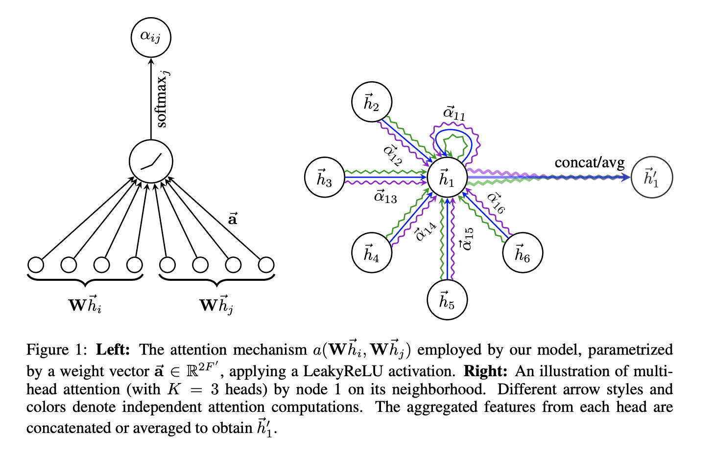

# **CogniNet team Final Project page for Machine Learning**

This repository contains the code and data for the final project course for machine learning, which aims to build benchmarking for classification problems based on fMRI data. The goal of this project is to compare current state-of-the-art methods on unimodal data and determine which approach works best for a given dataset, in order to inform future research in this area.

# **General Project Goals**
The general project goals are:
* Implement standard machine learning approaches, such as Logistic Regression, SVM, XGBoost, Random Forest and PCA, on unimodal datasets.
* Built a benchmark of ML methods and GAT on unimodal data.

# **Datasets**
For the project have been used two following datasets:
### COBRE
The Collaborative Breaking Down Schizophrenia (COBRE) dataset is a collection of brain imaging data from individuals with schizophrenia and healthy controls. It includes structural and functional MRI data from 152 participants, including 79 patients with schizophrenia and 73 healthy controls. Used labeling in matrices is Automated Anatomical Labeling (AAL).
### ABIDE
The Autism Brain Imaging Data Exchange (ABIDE) is a collection of brain correlation matrixes which were built from brain imaging data from individuals with autism spectrum disorder (ASD) and typically developing individuals. The dataset includes structural and functional MRI data from 1035 participants, including 530 with ASD and 505 healthy controls. Used labeling in matrices is Craddock200.

# **Methods**
1. Code description for ML part

In general in notebook is build a gridsearch function (number of folders = 5) which iterates over parametres for different machime learning models' parametres on train and validation splits, then takes the mean f1 score for every fold and defines the best model by this metric. After defining one best model on validation data it's been evaluated on test splits.

2. Code description for Graph Attention Network (GAT) part

#### GAT architecture 

# **Repository Structure**
- **Docs folder**: collection of images used for creating readme.md and presentation.
- **ML part folder**: 1) `cobre_2203.ipynb`, 2) `abide_2203.ipynb` and 3) `XGBoost_22.03` - three notebooks to run classic ML approaches.
- **abide folder**: 1) `abide_splits.json` - file with id which are split into train-val-test subsrts for 5 folds; 2) `abide_targets.csv` - from here `SUB_ID` or `subject` and `DX_GROUP` can be used as targets.
- **cobre folder**: 1) all folder - collection of data; 2) cobre_splits_new.json - splits into train-val-test subsrts for 5 folds; 3) cobre_targets.tsv - `Dx` is a target.

# **How to Use**
1. Implement classic machine learning (ML) approach
* step 1: Download `data` folder and correct Jupyter notebook considering the dataset you want to analyze
For COBRE go to `utoprey/CogniNet/cobre/aal`, for ABIDE use following link for downloading dataset: [ABIDE dataset](https://drive.google.com/drive/folders/1Xw-x9Zpfe-gEM0OLzDr35dlSzUVp2c2j?usp=sharing).
* step 2: Put your data in one folder. There should lay correct file for splits in `.json` format and appropriate data files `cobre` or `abide` (ex: `C:/Users/ZenBook/Desktop/schizophrenia/cobre/aal`)
* step 3: Run Jupyter notebook

2. Implement graph approach
* step 1:
* step 2:

# **Relevant papers**
Can be found [here](https://github.com/maryjis/multimodal_DL).

# **Conclusions**
## COBRE results
|      | F1 Score | Accuracy | ROC-AUC |
|------|:--------:|:--------:|:-------:|
| Logistic Regresioin |  0.73 ± 0.056       |   0.76 ± 0.045       |  0.76 ± 0.049    |
| Random Forest |   0.65 ± 0.073       |   0.69 ± 0.064       |   0.69 ± 0.065      |
| SVM |   **0.76 ± 0.058**       |   0.78 ± 0.039       |   0.79 ± 0.047      |
| SVM + PCA |   0.60 ± 0.009       |   0.58 ± 0.015       |   0.60 ± 0.013      |
| XGBoost |   0.67 ± 0.044       |   0.72 ± 0.029       |   0.71 ± 0.033      |

## ABIDE results
|      | F1 Score | Accuracy | ROC-AUC |
|------|:--------:|:--------:|:-------:|
| Logistic Regresioin |  0.66 ± 0.013       |   0.66 ± 0.013       |  0.66 ± 0.013    |
| Random Forest |   0.65 ± 0.037       |   0.67 ± 0.030       |   0.67 ± 0.031      |
| SVM |   0.67 ± 0.012       |   0.67 ± 0.013       |   0.67 ± 0.013      |
| SVM + PCA |   **0.69 ± 0.017**       |   0.68 ± 0.015       |   0.68 ± 0.016     |
| XGBoost |   0.65 ± 0.007       |   0.63 ± 0.010       |   0.63 ± 0.011      |

# **Prerequisites**
* Python 3.10
* Google Colaboratory service or Jupyter notebook

